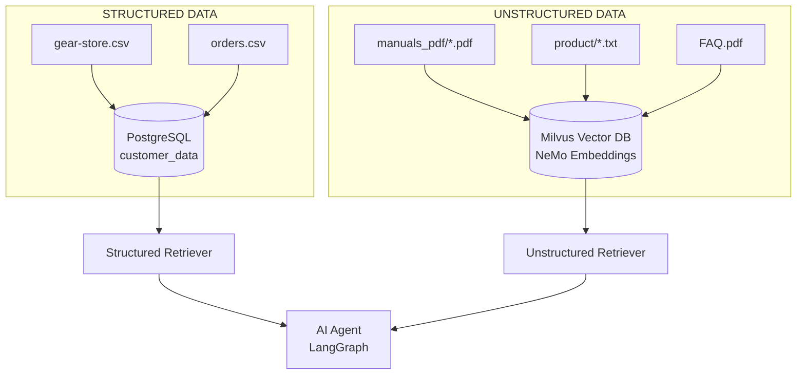

# Data Sources Documentation

This document describes all data sources in the AI Virtual Assistant blueprint, their locations, and how they are processed.

## Architecture Overview



---

## Structured Data

### 1. Product Catalog: `gear-store.csv`

| Attribute | Value |
|-----------|-------|
| Location | `data/gear-store.csv` |
| Rows | ~686 |
| Purpose | NVIDIA gear store product catalog |

**Schema:**

| Column | Description |
|--------|-------------|
| category | Product category (e.g., "NVIDIA Electronics", "Apparel") |
| subcategory | Product subcategory (e.g., "Geforce", "Mens") |
| name | Product name |
| description | Product description |
| price | Product price |

**Processing:** This file is the source for generating `product/*.txt` files (see below).

---

### 2. Order History: `orders.csv`

| Attribute | Value |
|-----------|-------|
| Location | `data/orders.csv` |
| Rows | ~573 |
| Purpose | Customer order transactions with return tracking |

**Schema:**

| Column | Description |
|--------|-------------|
| CID | Customer ID |
| OrderID | Order ID |
| product_name | Name of the product ordered |
| product_description | Description of the product |
| OrderDate | Date/time order was placed |
| Quantity | Number of units ordered |
| OrderAmount | Total order amount |
| OrderStatus | Status (Pending, Shipped, Delivered, Returned, etc.) |
| ReturnStatus | Return status (None, Requested, Approved, Rejected, etc.) |
| ReturnStartDate | Date return was initiated |
| ReturnReceivedDate | Date return was received |
| ReturnCompletedDate | Date return was completed |
| ReturnReason | Reason for return |
| Notes | Notes sent to customer |

**Processing:** Ingested into PostgreSQL `customer_data` table via `notebooks/ingest_data.ipynb`.

---

## Unstructured Data

### 1. Product Descriptions: `product/*.txt`

| Attribute | Value |
|-----------|-------|
| Location | `data/product/` |
| Files | 99 text files |
| File Size | 130-900 bytes each |

**Naming Convention:** `PRODUCT_NAME_Category_Subcategory.txt`

**Content Format:**
```
Name: <product name>
Category: <category>
Subcategory: <subcategory>
Price: $<price>
Description: <description>
```

**Processing:**
1. Generated from `gear-store.csv` by `notebooks/ingest_data.ipynb`
2. Uploaded to unstructured retriever API (`POST /documents`)
3. Embedded and stored in Milvus vector DB

---

### 2. GPU Manuals: `manuals_pdf/`

| Attribute | Value |
|-----------|-------|
| Location | `data/manuals_pdf/` |
| Files | 6 PDF files |
| File Size | 5-6 MB each |

**Files:**
- `GeForce_RTX_4090_QSG_Rev1.pdf`
- `GeForce_RTX_4080_QSG_Rev1.pdf`
- `GeForce_RTX_4070_QSG_Rev1.pdf`
- `GEFORCE_RTX_4080_SUPER_User_Guide_Rev1.pdf`
- `GEFORCE_RTX_4070_SUPER_User_Guide_Rev1.pdf`
- `GEFORCE_RTX_4060_Ti_User_Guide_Rev1.pdf`

**Processing:**
1. Downloaded via `data/download.sh` using URLs from `data/list_manuals.txt`
2. Uploaded to unstructured retriever API (`POST /documents`)
3. Chunked, embedded, and stored in Milvus vector DB

---

### 3. FAQ Document: `FAQ.pdf`

| Attribute | Value |
|-----------|-------|
| Location | `data/FAQ.pdf` |
| Size | ~192 KB |

**Processing:** Uploaded to unstructured retriever API and stored in Milvus.

---

## Data Processing Pipeline

### Notebook: `ingest_data.ipynb`

This notebook handles all data ingestion:

| Step | Action | Destination |
|------|--------|-------------|
| 1 | Upload PDFs from `manuals_pdf/` | Milvus (via `/documents` API) |
| 2 | Upload `FAQ.pdf` | Milvus (via `/documents` API) |
| 3 | Convert `gear-store.csv` → `product/*.txt` | Local filesystem |
| 4 | Upload `product/*.txt` files | Milvus (via `/documents` API) |
| 5 | Load `orders.csv` into PostgreSQL | `customer_data` table |

---

### Notebook: `synthetic_data_generation.ipynb`

Generates synthetic test data using Nemotron-4-340B:

| Output | Description |
|--------|-------------|
| `customers.csv` | 10 synthetic customer profiles |
| `orders.csv` | Order history for each customer (10 orders per customer) |

The generated `orders.csv` can be copied to `data/` for use.

---

### Notebook: `api_usage.ipynb`

Demonstrates API usage (does not process data):
- Agent APIs (port 8081): Session management, query generation, feedback
- Analytics APIs (port 8082): Session history, summaries, sentiment feedback
- Feedback data retrieval from PostgreSQL `feedback` table

---

## Database Destinations

### PostgreSQL
- **Database:** `customer_data`
- **Table:** `customer_data` - order history
- **Table:** `feedback` - user feedback (sentiment, summary, session ratings)

### Milvus (Vector DB)
- Stores embeddings for all unstructured data
- Used by the unstructured retriever for semantic search

---

## Quick Reference

| Data | Source File | Processing | Destination |
|------|-------------|------------|-------------|
| Products | `gear-store.csv` | Split to .txt files | Milvus |
| Orders | `orders.csv` | Direct insert | PostgreSQL |
| Manuals | `manuals_pdf/*.pdf` | Chunk + embed | Milvus |
| FAQ | `FAQ.pdf` | Chunk + embed | Milvus |
