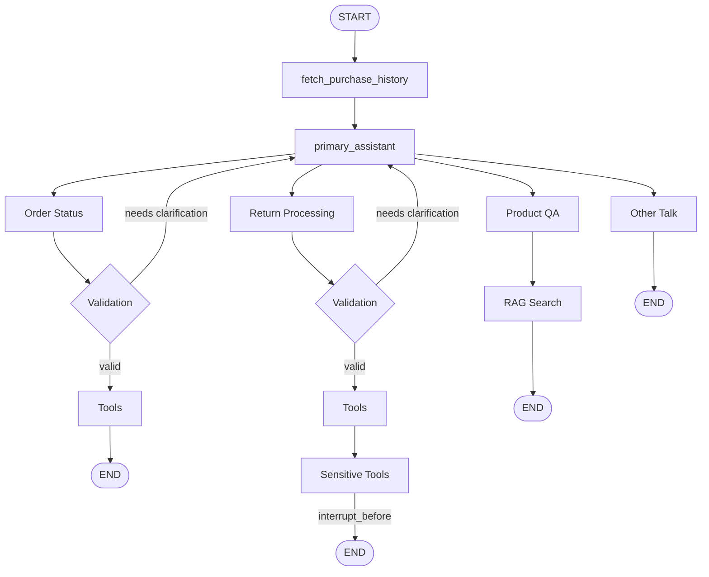

# Agent

This is the LangGraph agent for the AI Virtual Assistant. It handles customer service queries for the NVIDIA Gear Store including order status, return processing, and product Q&A.

---

## Directory Structure

```
src/agent/
├── main.py              # LangGraph graph definition (the core)
├── server.py            # FastAPI endpoints
├── tools.py             # Tool definitions + Pydantic routing models
├── utils.py             # Helper functions (LLM calls, checkpointer, RAG)
├── prompt.yaml          # All system prompts
├── cache/               # Session/conversation caching
│   ├── session_manager.py   # Abstraction layer for cache
│   ├── redis_client.py      # Redis implementation
│   └── local_cache.py       # In-memory implementation
├── datastore/           # Persistent storage
│   ├── datastore.py         # Abstraction layer for DB
│   └── postgres_client.py   # PostgreSQL implementation
├── Dockerfile
└── requirements.txt
```

---

## Agent Graph



---

## File Descriptions

### `main.py` - Graph Definition

The heart of the system. Defines the LangGraph `StateGraph` with:

| Component | Description |
|-----------|-------------|
| `State` (TypedDict) | Holds `messages`, `user_id`, `user_purchase_history`, `current_product`, `needs_clarification`, etc. |
| `Assistant` class | Generic async callable that wraps an LLM with tools and handles streaming |
| `builder.add_node()` | Registers each node (e.g., `primary_assistant`, `order_status`, `return_processing`) |
| `builder.add_conditional_edges()` | Routes based on tool calls to determine which sub-agent to invoke |
| `builder.compile()` | Produces the final `graph` with checkpointing and interrupt points |

### `server.py` - FastAPI Layer

| Endpoint | Method | Description |
|----------|--------|-------------|
| `/generate` | POST | Main chat endpoint - streams responses via SSE |
| `/create_session` | GET | Creates new session UUID |
| `/end_session` | GET | Moves conversation to permanent storage |
| `/delete_session` | DELETE | Cleans up session + checkpointer |
| `/feedback/response` | POST | Stores user feedback |
| `/health` | GET | Health check |
| `/metrics` | GET | Prometheus metrics |

The `/generate` endpoint handles:
1. Session validation
2. Graph state snapshot (for interrupt handling)
3. Streaming events from `graph.astream_events()`
4. Saving conversation to cache
5. Human-in-the-loop for sensitive actions (returns)

### `tools.py` - Tool Definitions

**A. LangChain Tools (decorated with `@tool`):**

| Tool | Type | Description |
|------|------|-------------|
| `structured_rag` | Safe | Text-to-SQL via external retriever service |
| `get_purchase_history` | Safe | Direct PostgreSQL query for user orders |
| `return_window_validation` | Safe | Check if return is within time window |
| `update_return` | **Sensitive** | Updates return status in DB (requires approval) |

**B. Pydantic Routing Models (used as "virtual tools"):**

| Model | Routes To |
|-------|-----------|
| `ToProductQAAssistant` | RAG-based product Q&A |
| `ToOrderStatusAssistant` | Order status sub-agent |
| `ToReturnProcessing` | Return processing sub-agent |
| `HandleOtherTalk` | Small talk handler |
| `ProductValidation` | Product disambiguation |

### `utils.py` - Helper Functions

| Function | Description |
|----------|-------------|
| `get_product_name()` | Uses LLM to extract product name from conversation |
| `create_tool_node_with_fallback()` | Wraps tools with error handling |
| `get_checkpointer()` | Returns PostgreSQL or in-memory checkpointer |
| `canonical_rag()` | Calls unstructured retriever for product docs |
| `remove_state_from_checkpointer()` | Cleans up checkpoint tables |

### `prompt.yaml` - System Prompts

| Key | Purpose |
|-----|---------|
| `primary_assistant_template` | Intent classification & routing |
| `order_status_template` | Order query responses |
| `return_processing_template` | Return handling |
| `rag_template` | Product Q&A from context |
| `other_talk_template` | Greetings and off-topic handling |
| `ask_clarification.*` | Product disambiguation prompts |
| `get_product_name.*` | Product extraction prompts |

### `cache/` - Session Management

`SessionManager` abstracts between Redis and local dict:
- Stores conversation history per session
- Tracks `user_id`, `conversation_hist`, timestamps
- Used by `/generate` to maintain context across requests

### `datastore/` - Persistent Storage

For long-term conversation storage when sessions end.

---

## State

```python
class State(TypedDict):
    messages: list[AnyMessage]      # Conversation history
    user_id: str                    # Customer ID
    user_purchase_history: Dict     # Cached order/return data
    current_product: str            # Product being discussed
    needs_clarification: bool       # Ask follow-up?
    clarification_type: str         # "no_product" | "multiple_products"
    reason: str                     # Clarification details
```

---

## Routing

The **primary_assistant** routes to sub-agents via tool calls:

| Tool Call | Destination |
|-----------|-------------|
| `ToOrderStatusAssistant` | Order status sub-agent |
| `ToReturnProcessing` | Return processing sub-agent |
| `ToProductQAAssistant` | Product Q&A (RAG) |
| `HandleOtherTalk` | Greetings/off-topic |

**Product Validation:** Before processing order/return queries, the agent extracts the product name and validates it exists in the user's purchase history. If 0 or 2+ matches, it asks for clarification.

---

## Human-in-the-Loop

The graph interrupts before `update_return` for approval:

```python
graph = builder.compile(
    checkpointer=memory,
    interrupt_before=["return_processing_sensitive_tools"]
)
```

When interrupted, the user is prompted: "Do you approve of the process the return? Type 'y' to continue..."

---

## RAG Retrieval

| Type | Endpoint | Backend | Use Case |
|------|----------|---------|----------|
| Structured | `structured-retriever:8081` | Vanna.AI + PostgreSQL | Order/return queries |
| Unstructured | `unstructured-retriever:8081` | Milvus | Product documentation |

---

## Key Architectural Patterns

1. **Multi-agent via Tool Routing** - The `primary_assistant` uses Pydantic models as "tools" to route to sub-agents
2. **Human-in-the-Loop** - `interrupt_before` pauses before executing sensitive return updates
3. **Checkpointing** - PostgreSQL or in-memory, tracks graph state per `thread_id` (session)
4. **Streaming** - Uses `astream_events()` with `should_stream` tags for real-time responses
5. **Abstracted Storage** - Cache and datastore layers support multiple backends (Redis/in-memory, PostgreSQL)
